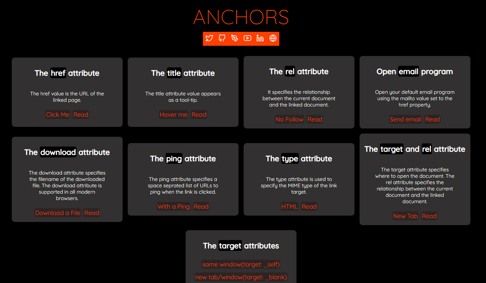

## Anchors
An application can have multiple anchors. Each anchor can have multiple attributes. Anchors can be used to create links to other parts of the project.

`Anchors` is a demo application that shows how to use anchors. It provides a simple interface to try out different anchor attributes. The extensive documentation for anchors can be found from the demo application.

<p align="center">
  
</p>  

## Demo Application
> Please access the demo application from the following link: [Anchors](anchors.vercel.app)

Please give the repo a ⭐ if you liked the work. It motivates me.

### Many Thanks to all the `Stargazers` who has supported this project with stars(⭐)

[](https://github.com/atapas/anchors/stargazers)


## Documentation
This section contains the documentation for the attributes with sample source code.

### The `href` attribute
The `href` attribute is used to specify the link target.

- Link to a page to another website:
```html
<a href="https://example.com">Click me</a>
```

- Link to a page to a section of the same website:
```html
<a href="#news">Go to the News section</a>

<div id="news">
  <h2>News</h2>
  <p>Here is some news</p>
</div>
```

- Link to open the default phone app
```html
<a href="tel:+914123456765">Call +914123456765</a>
```

- Link to open the default email app
```html
<a href="mailto:me@example.com">Send an email to me</a>
```

- You can link to a script and execute it with a single click.
```html
<a href="javascript:alert('Hello World!')">Click me</a>
```

Please find the possible values for the `href` attribute in the [w3c.org](https://www.w3schools.com/tags/att_a_href.asp) specification.

### The `title` attribute
The `title` attribute is used to specify the title of the link as a tooltip.

```html
<a href="https://example.com" title="Example Domain">Hover over me</a>
```

### The `rel` attribute
The `rel` attribute is used to specify the relationship between the current document and the link target.

```html
<a rel="nofollow" href="http://www.example.com/">No Follow</a>
```
Please find the complete list of possible values for the `rel` attribute in the [w3schools](https://www.w3schools.com/tags/att_a_rel.asp).

### The `download` attribute
The `download` attribute is used to specify the file name of the link target. This attribute is only supported in the [HTML5](https://www.w3schools.com/tags/att_a_download.asp) specification.

```html
<a download="example.pdf" href="https://example.com/example.pdf">Download</a>
```
### The `ping` attribute
The `ping` attribute is used to specify the URL of a pingback server. This attribute is only supported in the [HTML5](https://www.w3schools.com/tags/att_a_ping.asp)  specification. The ping attribute specifies a space seprated list of URLs to ping when the link is clicked.

```html
<a ping="http://www.example.com/pingback/" href="http://www.example.com/">Ping me</a>
```
### The `type` attribute
The `type` attribute is used to specify the MIME type of the link target. This attribute is only supported in the [HTML5](https://www.w3schools.com/tags/att_a_type.asp) specification.

```html
<a type="text/html" href="http://www.example.com/">HTML</a>
```

### The `hreflang` attribute
The `hreflang` attribute is used to specify the language of the link target. This attribute is only supported in the [HTML5](https://www.w3schools.com/tags/att_a_hreflang.asp) specification.

```html
<a hreflang="en" href="http://www.example.com/">English</a>
```

### The `referrerpolicy` attribute
The `referrerpolicy` attribute is used to specify the policy for the link target. This attribute is only supported in the [HTML5](https://www.w3schools.com/tags/att_a_referrerpolicy.asp) specification.

The possible values for the `referrerpolicy` attribute are:

```html
<a referrerpolicy="no-referrer|no-referrer-when-downgrade|origin|origin-when-cross-origin|same-origin|strict-origin-when-cross-origin|unsafe-url">
```

```html
<a href="https://www.example.com" referrerpolicy="no-referrer">
```
### The `target` attribute
The `target` attribute is used to specify the target frame of the link.

The possible values for the `target` attribute are:

```html
<a target="_blank|_self|_parent|_top|framename">
```

```html
<a href="https://example.com" target="_self">same window(target: _self)</a>

<a href="https://example.com" target="_blank" rel="noopener noreferrer">New Tab</a>
```

## Credits
This demo application is developed by [Tapas Adhikary](https://tapasadhikary.com) and is maintained by [Vercel](https://vercel.com).


